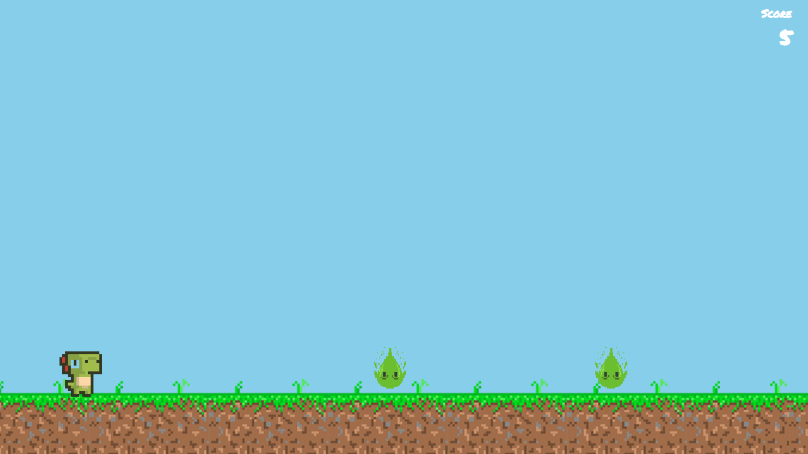

# React Dino Game

My simple mini game project with React
<!-- TODO: replace by a video intro -->



## Preview

<a href="https://react-dino-game.netlify.app/" target="_blank">Play Game!</a>

## How to install

**Step 1:**

Clone this repo:

```
git@github.com:labiebhn/react-dino-game.git
```

**Step 2:**

Go to project root and execute the following command in console to get the required dependencies: 

```
yarn
```

**Step 3:**

Runs the app in the development mode.

```
yarn start
```

**Step 4:**

Builds the app for production to the build folder.

```
yarn build
```